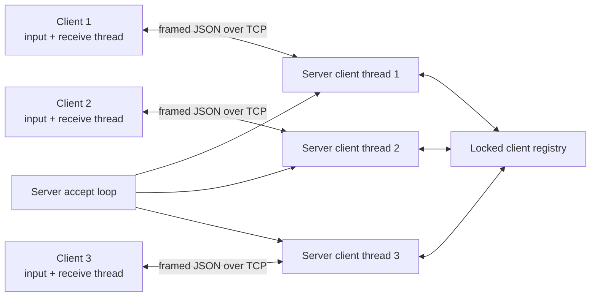

# Python Multi-Client TCP Chat

A terminal-based, educational chat application built with Python's standard library. A concurrent TCP server supports multiple clients, public and private messages, user discovery, and clean disconnects. Messages use length-prefixed JSON so communication remains reliable even when TCP splits or combines reads.

## Features

- Multiple simultaneous clients with one server thread per connection
- Background receive thread in each client, allowing sending and receiving at the same time
- Case-insensitive unique username registration
- Public chat broadcasts and join/leave notifications
- Private messages with `/msg`
- Connected-user listing with `/users`
- Built-in `/help` and clean `/quit`
- Framed UTF-8 JSON protocol with a 64 KiB payload limit
- Validation of usernames, message content, message types, framing, and JSON
- Graceful handling of socket errors, abrupt disconnects, and server `Ctrl+C`
- Automated protocol and loopback integration tests

## Technologies and concepts

The project uses Python 3, TCP/IP sockets, threads, locks, events, JSON serialization, binary length headers, command-line arguments, context-independent cleanup, type hints, dataclasses, and `unittest`. It has no third-party runtime dependencies.

## Project structure

```text
python-tcp-chat/
├── server.py
├── client.py
├── protocol.py
├── tests/
│   ├── __init__.py
│   ├── test_protocol.py
│   └── test_server.py
├── README.md
└── .gitignore
```

## Architecture

`ChatServer` owns the listening socket and a username-to-session registry protected by a lock. The accept loop starts one worker thread for each connection. Each session also has a send lock, preventing frames from different server threads from being interleaved on the same socket.

The client reads terminal input on its main thread and receives server messages on a background thread. Both sides share `protocol.py`, which is responsible for encoding, framing, size validation, exact reads, and JSON decoding.



## TCP message framing

TCP provides an ordered byte stream, not individual messages. One `send` may arrive through several `recv` calls, and several sends may be available in one receive buffer. Every application message therefore uses this frame:

```text
4-byte unsigned big-endian payload length | UTF-8 JSON payload
```

`receive_exactly` loops until all requested bytes arrive. `receive_message` first reads the four-byte header, rejects zero or oversized lengths, then reads and validates exactly one JSON payload. The maximum JSON payload is 65,536 bytes.

## Message protocol

| Type | Direction | Important fields | Purpose |
|---|---|---|---|
| `register` | Both | `username`; response `status` | Request or confirm username registration |
| `chat` | Both | `message`, server adds `from` | Send and broadcast a public message |
| `private` | Both | `to`, `message`, server adds `from` | Send a private message; echoed to sender |
| `system` | Server → client | `message` | Join, leave, help, and informational notices |
| `user_list` | Both | response `users` | Request or return connected usernames |
| `help` | Client → server | none | Request available commands |
| `error` | Server → client | `message` | Report invalid input or protocol usage |
| `disconnect` | Both | optional `message` | End a connection or announce shutdown |

## Requirements

- Python 3.10 or newer
- Windows PowerShell (commands below); the Python programs are otherwise platform-independent
- No package installation is required

## Run the application

Open PowerShell in the project directory. Start the server:

```powershell
python server.py
```

The defaults are host `127.0.0.1` and port `5000`. To choose another interface or port:

```powershell
python server.py --host 127.0.0.1 --port 6000
```

Open a second PowerShell window for the first client:

```powershell
python client.py
```

Open a third PowerShell window for another client:

```powershell
python client.py
```

When using a non-default server port, pass the same values to every client:

```powershell
python client.py --host 127.0.0.1 --port 6000
```

Each client is prompted for a username. Usernames are 1–24 characters and may contain letters, numbers, underscores, and hyphens.

## Chat commands

| Command | Example | Result |
|---|---|---|
| Normal text | `Hello everyone!` | Broadcast to every connected user |
| `/users` | `/users` | Display connected usernames |
| `/msg <username> <message>` | `/msg Alice Hello!` | Send a private message to Alice |
| `/help` | `/help` | Display available commands |
| `/quit` | `/quit` | Disconnect cleanly |

Empty input and unknown or incomplete commands are reported locally. The server also validates every received message and returns an error for invalid content or types.

## Automated tests

Run the complete test suite from the project directory:

```powershell
python -m unittest discover -v
```

The tests use only loopback sockets and ephemeral ports. They cover framing, partial TCP reads, multiple frames, invalid and oversized data, registration, duplicate names, broadcasting, private messages, user lists, help, clean and abrupt disconnects, and three concurrent clients.

## Manual multi-client test

1. Run `python server.py` in one terminal.
2. Run `python client.py` in three additional terminals.
3. Register three distinct usernames.
4. Send a normal message from each client and confirm all three clients display it.
5. Run `/users` and confirm all usernames appear.
6. Run `/msg OtherUser private hello` and confirm only the sender and recipient see it.
7. Run `/help` and check the command list.
8. Run `/quit` in one client and confirm the other clients see its leave notice.
9. Close another client terminal abruptly and confirm its leave notice appears.
10. Press `Ctrl+C` in the server terminal and confirm connected clients receive the shutdown notice.

## Error handling and concurrency

The server catches connection loss, malformed messages, invalid content, duplicate usernames, and socket errors without stopping other client threads. Shutdown closes the listening socket and all registered client sockets, which releases threads blocked in socket reads. Shared client information is always read or changed under a lock. A separate lock on each client session serializes outgoing frames.

The interactive client reports connection failures and protocol errors, closes its socket in all exit paths, and uses a receive thread so incoming messages do not wait for the user to finish composing a message.

## Security considerations

This is an educational application intended for trusted local testing. It has no encryption, authentication, access control, rate limiting, persistent history, moderation, audit logging, or production deployment safeguards. Usernames identify a connection but do not prove identity. Do not expose the server to an untrusted network or send sensitive information through it.

The size limit reduces memory abuse from a single frame, and JSON avoids the arbitrary-code risks associated with insecure formats such as `pickle`; these controls do not make the application production-safe.

## Current limitations

- In-memory state disappears when the server stops.
- One operating-system thread is created per client, which is unsuitable for very large deployments.
- Messages are plain text over TCP and can be observed or modified by network intermediaries.
- There are no chat rooms, message history, file transfers, reconnect/resume support, or delivery acknowledgements.
- Terminal output can appear while a user is typing because there is no full-screen terminal UI.
- Depending on the terminal, the client may require Enter to be pressed after the server disconnects because the main thread is blocked while waiting for user input.

## Possible improvements

- TLS encryption and authenticated accounts
- Rate limiting, moderation, and structured logging
- Persistent message history and reconnect support
- Multiple rooms and presence states
- An `asyncio` server for larger connection counts
- Packaging, continuous integration, and static type/lint checks
